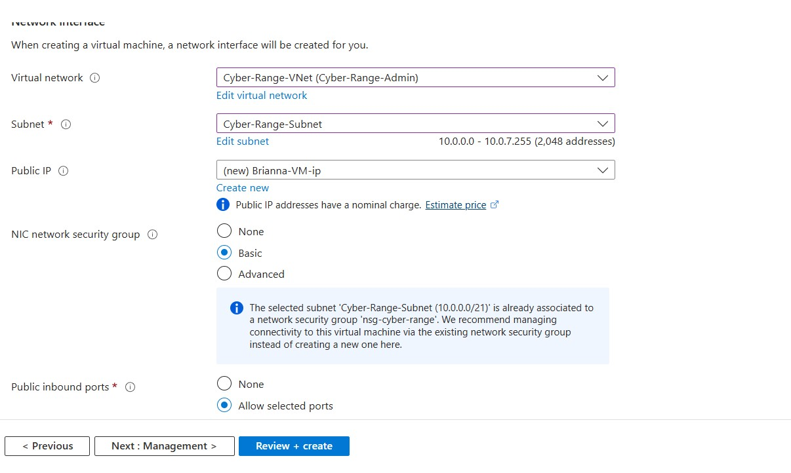
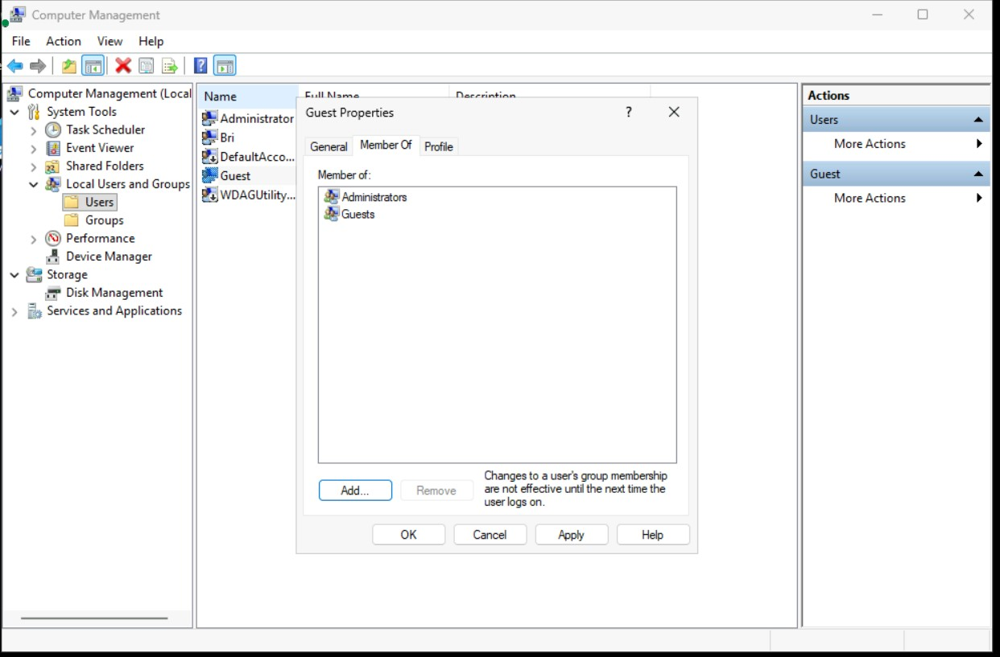

# DISA STIG Windows 11 – Advanced Network Compliance Scan

## Project Overview

This project demonstrates a **Windows 11 compliance assessment** using the **DISA Microsoft Windows 11 STIG v2r5** within **Tenable Vulnerability Management**, deployed on a **Microsoft Azure Virtual Machine**.

The objective was to assess security configuration compliance, identify STIG violations, and document remediation strategies aligned with **security governance, risk management, and compliance (GRC)** principles.

---

## Objectives

- Perform an authenticated **STIG-based compliance scan**
- Identify Windows 11 security misconfigurations
- Analyze findings through a compliance and risk lens
- Propose remediation strategies aligned with DISA STIG guidance
- Demonstrate real-world compliance assessment workflows

---

## Environment & Architecture

- **Cloud Platform:** Microsoft Azure  
- **Target System:** Windows 11 Pro (x64) Virtual Machine  
- **Scan Platform:** Tenable Vulnerability Management  
- **Compliance Framework:** DISA Microsoft Windows 11 STIG v2r5  
- **Connectivity:** Azure Bastion (secure RDP)  
- **Network Security:** Azure Network Security Group (NSG)

---

## Secure VM Access (Azure Bastion)

Azure Bastion was used to securely access the Windows 11 VM without exposing it directly to the public internet, aligning with security best practices.

---

## Scan Configuration (Advanced Network Scan)

An **Advanced Network Scan** template was created in Tenable to support authenticated compliance auditing.

### Key Configuration Details
- Credentialed scan using a local Administrator account
- Remote Registry, Server service, and Admin Shares enabled
- Ping discovery and full TCP port scanning enabled
- Thorough assessment tests enabled
- DISA Microsoft Windows 11 STIG v2r5 added as a Compliance Audit

---

## Findings Summary

The scan identified **132 total findings**, largely centered around configuration and policy enforcement gaps.

| Severity | Count |
|--------|------|
| Critical | 0 |
| High | 3 |
| Medium | 2 |
| Low | 2 |
| Informational | 125 |
| **Total** | **132** |

### Notable Findings
- Windows Defender Firewall disabled across all profiles
- Guest account enabled and assigned administrative privileges
- Weak password and account policy enforcement
- Outdated or vulnerable applications
- Untrusted or self-signed SSL certificates
- Excessive inbound network exposure via NSG rules

---

## Compliance Risk Analysis

These findings represent **direct violations of DISA STIG controls** and increase organizational risk by enabling:

- Privilege escalation through improper account management
- Network-based attacks due to weak firewall posture
- Credential compromise from insecure authentication policies
- Reduced audit readiness and regulatory compliance posture

---

## Solutions & Remediation Recommendations

### 1. Account & Privilege Management

**Issues Identified**
- Guest account enabled
- Guest account added to the Administrators group
- Insecure administrator account configuration

**Recommended Solutions**
- Disable the Guest account entirely
- Remove Guest from all privileged groups
- Enforce least-privilege access
- Apply strong password policies with expiration and history enforcement

---

### 2. Firewall & Network Security

**Issues Identified**
- Windows Defender Firewall disabled
- NSG configured to allow unrestricted inbound traffic

**Recommended Solutions**
- Enable Windows Defender Firewall for Domain, Private, and Public profiles
- Restrict inbound NSG rules to required ports only
- Enforce deny-by-default inbound traffic policies

---

### 3. Patch & Update Compliance

**Issues Identified**
- Missing Windows security updates
- Outdated third-party applications

**Recommended Solutions**
- Re-enable Windows Update services
- Apply all pending OS and application patches
- Establish a recurring patch management cadence
- Validate remediation through follow-up scans

---

### 4. Certificate & Encryption Controls

**Issues Identified**
- Self-signed or untrusted SSL certificates
- Weak cryptographic configurations

**Recommended Solutions**
- Replace self-signed certificates with trusted CA-issued certificates
- Enforce STIG-approved encryption standards
- Remove deprecated protocols and cipher suites

---

### 5. Continuous Compliance Monitoring

**Recommended Practices**
- Schedule recurring authenticated compliance scans
- Track STIG findings for trend and risk analysis
- Maintain remediation evidence for audits
- Align technical findings with governance and risk reporting

---

## Key Takeaways

This project demonstrates how **STIG-based compliance scanning supports governance and risk management objectives**. Mapping technical findings to compliance controls enables actionable insights for security, audit, and compliance stakeholders.

### Skills Demonstrated
- DISA STIG compliance assessment
- Vulnerability and configuration analysis
- Secure Azure VM deployment
- Risk-based remediation planning
- Governance, Risk, and Compliance (GRC) alignment

---

## Disclaimer

This project was conducted in a **controlled lab environment** for educational and portfolio purposes. Systems were intentionally misconfigured to simulate compliance violations.
